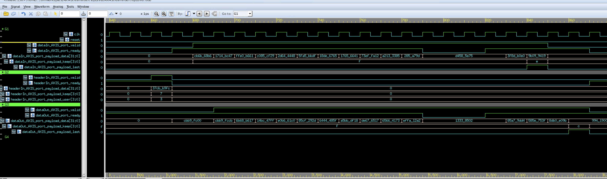

# 达坦科技面试项目
## 题目
- 对两路 AXIS 信号进行拼接，拼接信号满足 AXIS 协议输出
- 需要去除帧头通道 AXIS 的无效信号，需要对拼接信号进行内容重排
- 禁止使用状态机及 FIFO，实现无存储的信号反压
- 随机验证

## 实现说明
### 环境
- Ubuntu 20.04.1
- SpinalHDL 1.7.1
- VCS & Verdi 2018

### 设计介绍
主要解决数据流向问题，先从数据流向设计开始入手。

对两路信号进行拼接，则需要先控制接收 Header 路信号，通过配合控制 headerIn_Axis_ready 和 dataIn_Axis_ready 来实现同周期内处理一路信号。headerIn_Axis_user 为题目所提供的 Header 内字节有效个数。在完成 Header 信号的接收后，可以根据该数据完成一次拼接的数据流向配置，主要控制模块内部多路选择器。下图是根据 Header 字节有效个数来完成 Header 数据到 Issue Cache 的映射关系。

先将有效的 Header 字节按照上面映射关系提交到 Issue Cache 对应的位置，然后将当前模块可接收通道切换至 Data 路。下图是根据 Header 字节有效个数来完成 Data 数据到 Issue Cache 和 Data Cache 的映射关系。

由于 Header 内的字节有效数每次接收都是不确定的，所以对于 Data 需要进行缓冲处理，避免数据丢失。在这里采用了直通和缓冲相结合。对于 Issue Cache 中为空或已经缓冲了部分字节的数据，可以将当前 Data 直接提交到 Issue Cache 中，减少等待周期。没有在当前有效周期提交到 Issue Cache 的 Data 会先提交到 Data Cache 中保留，等到下一个有效周期再提交到 Issue Cache 中。

数据通路基本描述完成。控制通路直接通过数据的有效来完成实现。

### 仿真结果

由仿真结果可以看到基本完成题目实现效果要求，其中上图后半部分结果输出为下级反压模拟。仿真为了方便，直接在 SpinalHDL 上完成了 Testbench 的编写，符合随机验证要求。

### 其他说明
在代码上，虽然使用了 SpinalHDL 进行开发，但基于其进行开发的经验相较少，所以在使用上还比较像传统的 Verilog 设计电路。